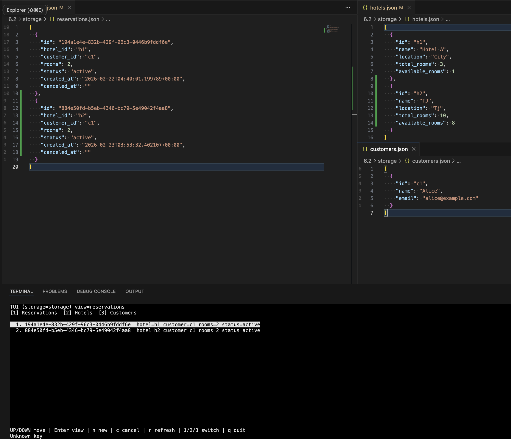

# Actividad 6.2 - Ejercicio de programación 3

**Tec de Monterrey | Maestría en Inteligencia Artificial (MNA)**  
Pruebas de software y aseguramiento de la calidad (Gpo 10)  

David A. Serrano Garcia  
Matrícula: A01795935  
Correo: a01795935@tec.mx


---


## Quick Start

Ejecuta el proyecto en 3 pasos simples:

### 1. Instalar dependencias

```
make install
```

### 2. Crear almacenamiento

```
make store
```

### 3. Ejecutar


TUI (interfaz visual):

```
make tui
```



---

## Estrategia de desarrollo

El desarrollo se realizó de forma incremental, priorizando pruebas, desacoplamiento y trazabilidad:

1. **Estructura base del proyecto**  
   Se definió una estructura modular con separación clara de responsabilidades:
   - `src/` código fuente
   - `tests/` pruebas
   - `logs/` evidencia de ejecución
   - `storage/` persistencia de datos JSON
   - `scripts/` automatización de ejemplos
   - `Makefile` para ejecución estandarizada

2. **Diseño de capa de persistencia**  
   Se implementó un paquete reusable `persistence/`:
   - `BaseModel`: validación y serialización
   - `JSONStorage`: lectura/escritura defensiva de archivos JSON
   - `Repository`: CRUD genérico desacoplado del dominio

3. **Desarrollo guiado por pruebas (TDD parcial)**  
   Se implementaron pruebas antes y durante la lógica:
   - `test_persistence_model.py`
   - `test_persistence_storage.py`
   - `test_persistence_repository.py`
   - `test_reservation_service.py`

   Los logs de ejecución se almacenan en `logs/test/` como evidencia.

4. **Lógica de negocio desacoplada**  
   Se creó el paquete `reservation/` que encapsula:
   - Entidades: `Hotel`, `Customer`, `Reservation`
   - Servicio: `ReservationService`

   Toda la lógica de negocio se implementa en el servicio, sin dependencias del CLI.

5. **CLI desacoplado**  
   Se implementó un CLI en `src/cli/main.py` que:
   - Interpreta comandos
   - Invoca `ReservationService`
   - Soporta modo interactivo (shell)

6. **Automatización y ejecución reproducible**  
   El `Makefile` centraliza:
   - instalación
   - ejecución
   - pruebas
   - lint
   - logs con timestamp

7. **Calidad de código**  
   Se utilizaron herramientas:
   - flake8
   - pylint
   - black

   Los resultados se almacenan en `logs/lint/`.

---

## Descripción

Sistema CLI en Python para la gestión de:

- Hoteles
- Clientes
- Reservaciones

Persistencia basada en archivos JSON, con manejo defensivo de errores.

Incluye:
- CRUD de entidades
- Validaciones de dominio
- Manejo de disponibilidad de habitaciones
- Cancelación de reservaciones
- Logs de ejecución

---

## Estructura

```
6.2/
├── Makefile
├── scripts/
│   └── run_examples.sh
├── storage/
│   ├── hotels.json
│   ├── customers.json
│   └── reservations.json
├── src/
│   ├── cli/
│   │   └── main.py
│   ├── persistence/
│   │   ├── model.py
│   │   ├── repository.py
│   │   └── storage_json.py
│   └── reservation/
│       ├── service.py
│       └── models (Hotel, Customer, Reservation)
├── tests/
│   ├── test_persistence_model.py
│   ├── test_persistence_storage.py
│   ├── test_persistence_repository.py
│   └── test_reservation_service.py
├── logs/
│   ├── run/
│   ├── test/
│   └── lint/
└── README.md
```

---

## Uso

### Instalación

```
make install
```

---

### Ejecución CLI

Ejemplo:

```
make run ARGS="hotels create --id h1 --name 'Hotel A' --location City --total-rooms 3 --available-rooms 3"
```

Otros ejemplos:

```
make run ARGS="customers create --id c1 --name Alice --email alice@example.com"

make run ARGS="reservations create --customer-id c1 --hotel-id h1 --rooms 2"

make run ARGS="reservations list"
```

---

### Modo interactivo

Si no se pasan argumentos:

```
make run
```

Se abre un shell interactivo:

```
store> hotels list
store> reservations create --customer-id c1 --hotel-id h1 --rooms 1
store> exit
```

---

### Script de ejemplos

```
./scripts/run_examples.sh
```

---

## Pruebas

```
make test
```

Incluye pruebas para:

- Modelos
- Persistencia
- Repositorios
- Servicio de reservaciones

---

## Logs

Se generan logs con timestamp:

- `logs/run/` ejecución del CLI
- `logs/test/` pruebas
- `logs/lint/` análisis estático

Formato:

```
*_YYYYMMDD_HHMMSS.stdout.log
*_YYYYMMDD_HHMMSS.stderr.log
```

---

## Persistencia

Los datos se almacenan en JSON dentro de `storage/`:

- `hotels.json`
- `customers.json`
- `reservations.json`

Se puede cambiar el directorio usando variable de entorno:

```
STORAGE_DIR=otro_dir make run
```

---

## Manejo de errores

El sistema es tolerante a errores:

- JSON inválido no rompe la ejecución
- registros inválidos se ignoran
- operaciones inválidas regresan error controlado

Ejemplos:

- reservación sin cliente
- reservación sin hotel
- habitaciones insuficientes

---

## Diseño

Arquitectura en capas:

- `persistence`: acceso a datos
- `reservation`: lógica de negocio
- `cli`: interfaz de usuario

Principios aplicados:

- separación de responsabilidades
- código testable
- manejo defensivo
- tipado con Python moderno (`list[str]`, `Self`, etc.)

---

## Requisitos cubiertos

1. Diseño modular
2. Uso de pruebas unitarias
3. Persistencia en archivos
4. CLI funcional
5. Manejo de errores
6. Logs de ejecución
7. Código limpio y documentado
8. Cumplimiento PEP8

---

## Calidad de código

Herramientas:

- flake8
- pylint
- black

Resultados:

- sin errores críticos
- estructura mantenible
- cobertura funcional validada por pruebas

---

## Notas

- Los errores impresos en logs son esperados en escenarios de prueba
- Los tests incluyen casos negativos para validar robustez
- La capa de persistencia es reutilizable para otros proyectos

---